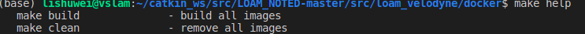
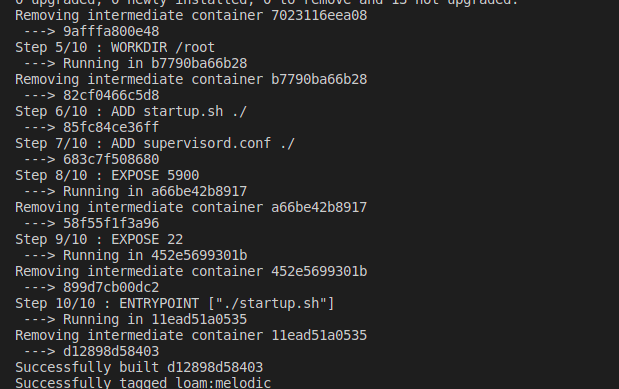
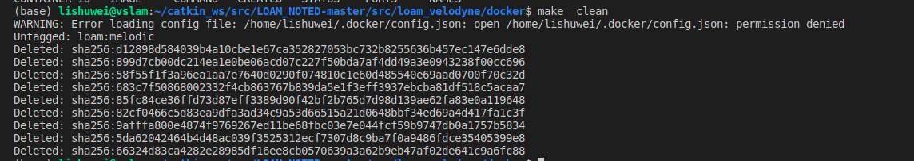
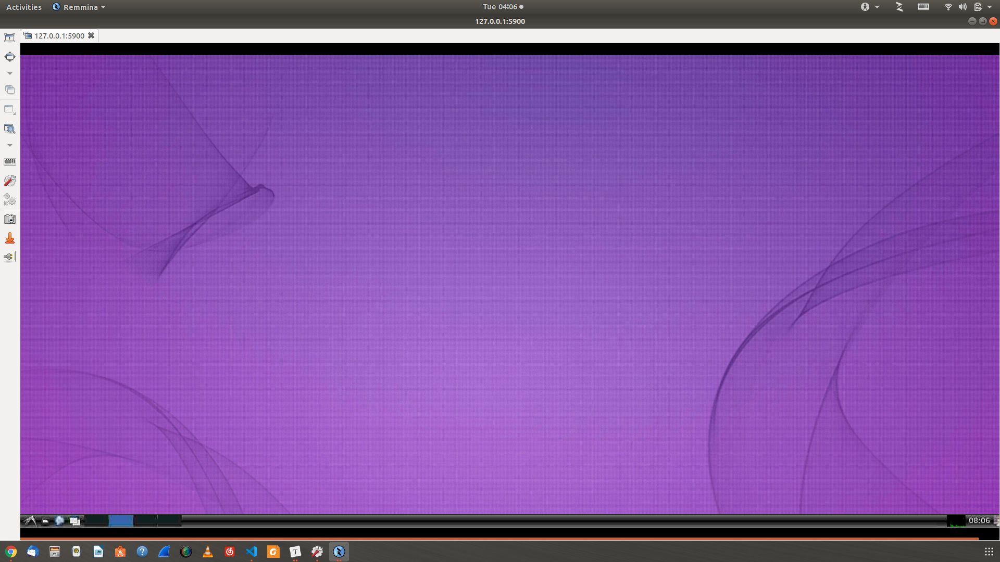
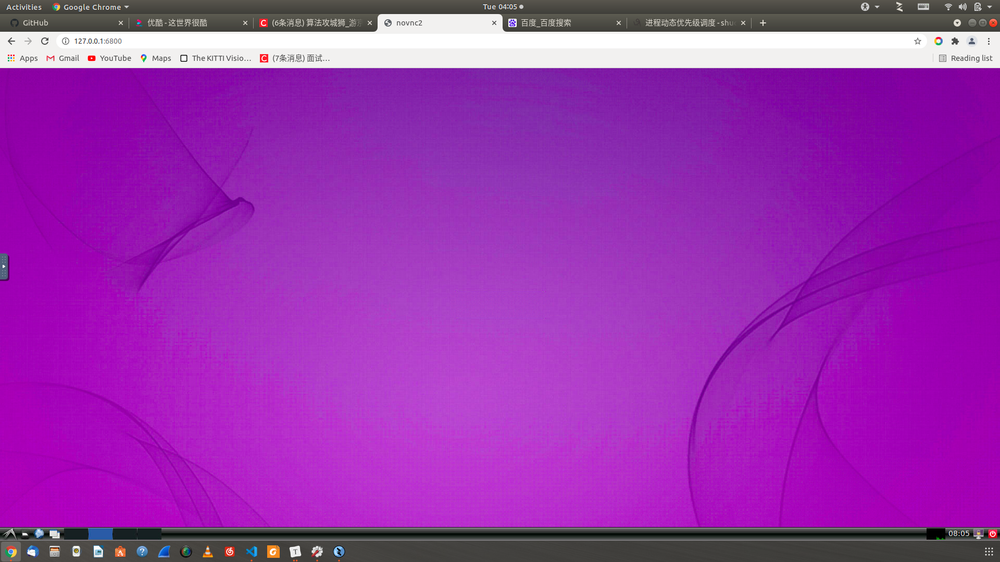

本人小白一个，为了简单使用镜像，简化操作，参考泡泡机器人基础上，搞了一些操作，欢迎大佬来指出错误，优化方案，也可以提需求哈哈哈。
构建docker镜像，环境包括：ros-melodic,vnc,ssh还有一些库
### 安装docker
ubuntu参考：https://docs.docker.com/engine/install/ubuntu/
    
### 构建生成image
切换到docker目录下：
* 帮助
    make help  

* 生产镜像  
    make build   

* 将del镜像
    make clean

### 运行容器
    sudo chmod +x  run_image.sh
    ./run_image.sh

 
### 界面使用
我使用的是Remmina,也可以vnc,如果没有就安装

使用浏览器

### 可能错误
1.got 'NOSPLIT' (does the network require authentication?)
    可以更换一下网络
### ref:
1.https://www.yuque.com/grep/kubernetes/xpksoq
2.https://github.com/PaoPaoRobot/docker-ubuntu-xfce-vnc-desktop
3.https://www.bilibili.com/video/BV1uK4y1k7Q1?from=search&seid=4055458955261017336
4.https://github.com/fbottarel/docker-ros-desktop-full

